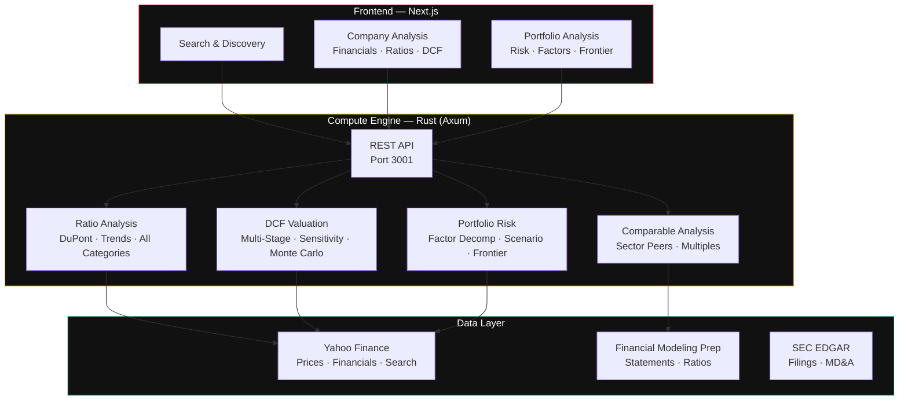

<div align="center">


<br>
<br>


</div>

---

## Real-time Financial Analysis

A financial analysis platform that takes any public company or portfolio and returns: full financial statement breakdown, DuPont ratio decomposition, multi-stage DCF valuation with Monte Carlo simulation, comparable company analysis against sector peers, portfolio risk decomposition by factor, efficient frontier optimization, and scenario analysis.

---

## System Architecture



---

## What It Does

### Company Analysis

Analysis Output
Income Statement Revenue growth (YoY, 3Y CAGR, 5Y CAGR), gross/operating/net margin trends, EPS growth
Balance Sheet Current/quick/cash ratios, debt-to-equity, debt-to-EBITDA, interest coverage, asset turnover
Profitability ROE (DuPont decomposition), ROA, ROIC, margins
Cash Flow Free cash flow yield, operating CF to net income, capex to revenue, FCF conversion
Valuation Ratios P/E, P/B, P/S, EV/EBITDA, PEG, dividend yield

### DCF Valuation

Feature Detail
Multi-stage model High growth period (5 years), transition period, terminal value
Configurable assumptions Revenue growth by year, EBITDA margin expansion, capex, working capital, tax rate, WACC
WACC computation Cost of equity (CAPM), cost of debt, capital structure weights
Sensitivity table Fair value across ranges of WACC and terminal growth rate
Monte Carlo simulation 10,000 iterations varying growth, margins, and discount rate → probability distribution of fair value

### Comparable Company Analysis

Feature Detail
Peer group selection Auto-selected by sector and industry with configurable overrides
Multiple comparison EV/EBITDA, P/E, P/B, P/S, EV/Revenue, PEG ratio
Premium/discount Where does this company trade relative to peers?
Composite valuation Weighted average of DCF and comparable company implied values

### Portfolio Analysis

Feature Detail
Performance Total return, annualized return, cumulative return chart
Risk Volatility (annualized), beta, Sharpe ratio, Sortino ratio, max drawdown, drawdown duration, VaR, CVaR
Factor decomposition Market beta, size, value, momentum, quality exposure
Efficient frontier 50 points across risk spectrum, optimal portfolio identification
Scenario analysis GFC 2008, COVID 2020, Stagflation, Tech Bubble
Holdings Individual asset contribution to risk and return

---

### API Endpoints

Method Endpoint Description
GET /api/health Health check
GET /api/search?q=AAPL Search companies by ticker or name
GET /api/company/AAPL Full company analysis (financials + ratios + DCF + comparable + insights)
GET /api/company/AAPL/financials Financial statements only
GET /api/company/AAPL/ratios Ratio analysis only
GET /api/company/AAPL/dcf DCF valuation only
GET /api/company/AAPL/comparable Comparable analysis only
GET /api/portfolio/analyze?tickers=AAPL,MSFT,GOOGL&weights=0.3,0.4,0.3 Portfolio analysis

---

#### Quick Start

```bash
 Clone
git clone https://github.com/CharlesMfouapon/valytics.git
cd valytics

 Backend

cd backend
cargo build --release
cargo run

 API running on http://localhost:3001

 Frontend (separate terminal)
cd frontend
npm install
npm run dev

 App running on http://localhost:3000
```

---

## Tech Stack

### Layer Technology Why
Compute engine Rust (Axum) Zero-cost abstractions, memory safety, performance
Financial data Yahoo Finance, Financial Modeling Prep, SEC EDGAR Multi-source with fallback chain
Monte Carlo Rust + rayon Parallel simulation across CPU cores
Frontend Next.js + TypeScript SSR, routing, performance
Charts Recharts Composable, responsive, interactive
Styling Tailwind CSS Utility-first, dark theme optimized

---

## Repository Structure

```
valytics/
├── backend/
│   ├── Cargo.toml
│   └── src/
│       ├── main.rs                    # Axum server entry
│       ├── config.rs                  # Environment configuration
│       ├── api/
│       │   ├── mod.rs                 # Health check, search
│       │   ├── company.rs             # Company analysis endpoints
│       │   └── portfolio.rs           # Portfolio analysis endpoint
│       ├── models/
│       │   ├── mod.rs                 # Core types
│       │   ├── company.rs             # Company analysis response types
│       │   ├── portfolio.rs           # Portfolio analysis response types
│       │   └── valuation.rs           # DCF and Monte Carlo parameters
│       ├── analysis/
│       │   ├── mod.rs
│       │   ├── ratios.rs              # All ratio computations + DuPont
│       │   ├── dcf.rs                 # Multi-stage DCF + sensitivity
│       │   ├── comparable.rs          # Peer group comparison
│       │   ├── monte_carlo.rs         # 10K iteration DCF simulation
│       │   ├── portfolio_risk.rs      # Risk metrics, factors, scenarios
│       │   └── efficient_frontier.rs  # Portfolio optimization
│       └── data/
│           ├── mod.rs                 # DataProvider trait
│           └── yahoo.rs               # Yahoo Finance client
├── frontend/
│   ├── package.json
│   ├── next.config.js
│   └── src/
│       ├── app/
│       │   ├── page.tsx               # Homepage with search
│       │   ├── layout.tsx             # Root layout
│       │   └── company/[ticker]/
│       │       └── page.tsx           # Full company analysis page
│       └── components/                #
└── README.md
```

---

## Roadmap

Phase Feature Status
1. Company search + financials + ratios Built
2. Multi-stage DCF + Monte Carlo Built
3. Comparable company analysis Built
4. Portfolio risk + efficient frontier Built
5. Portfolio page with interactive charts In Progress
6. User accounts + saved analyses Planned
7. Export to PDF/Excel Planned
8. Real-time data with WebSocket streaming Planned

---
